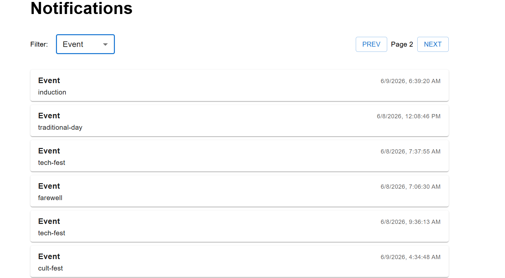
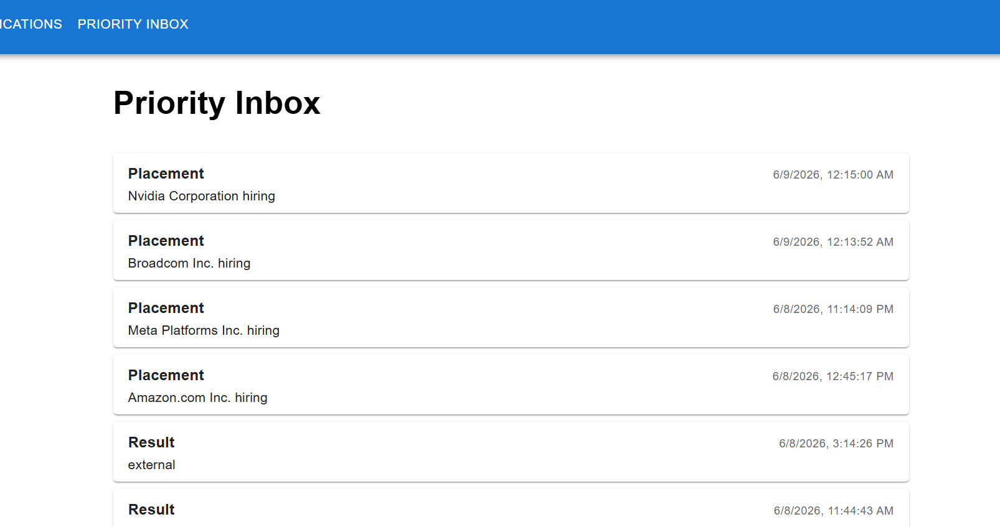
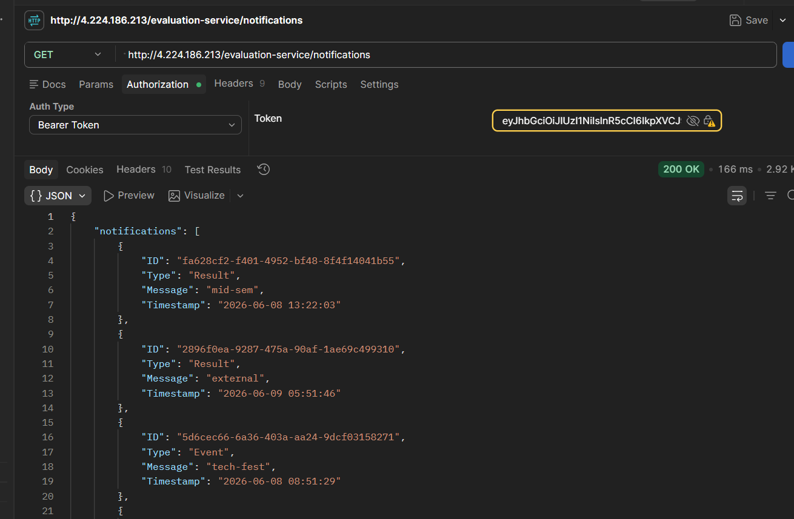
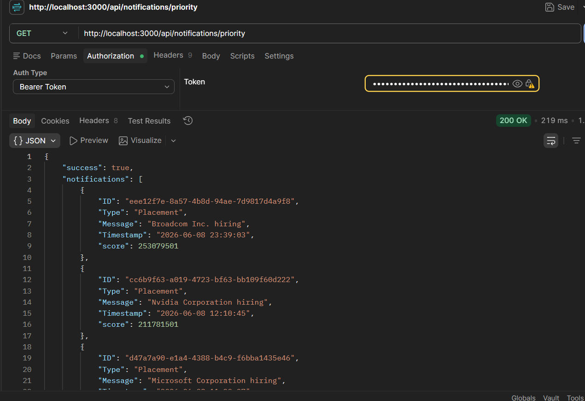
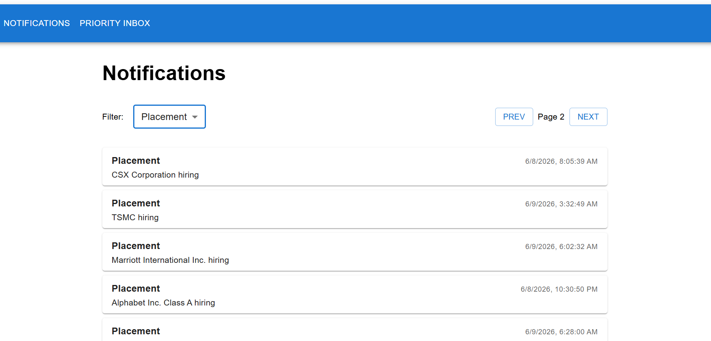
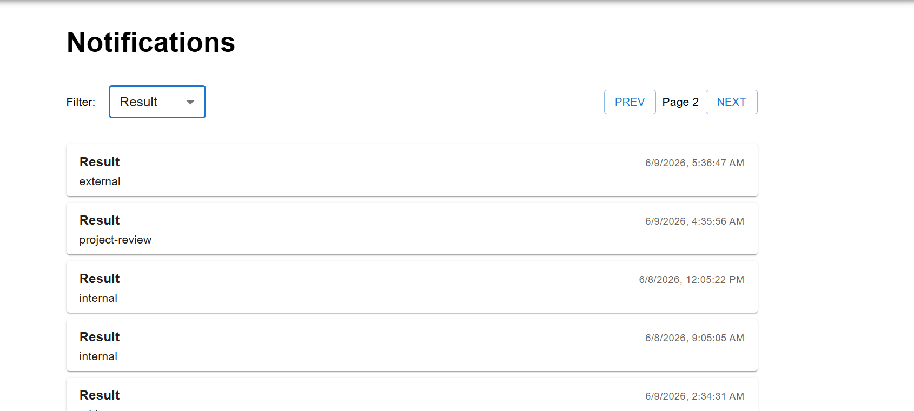
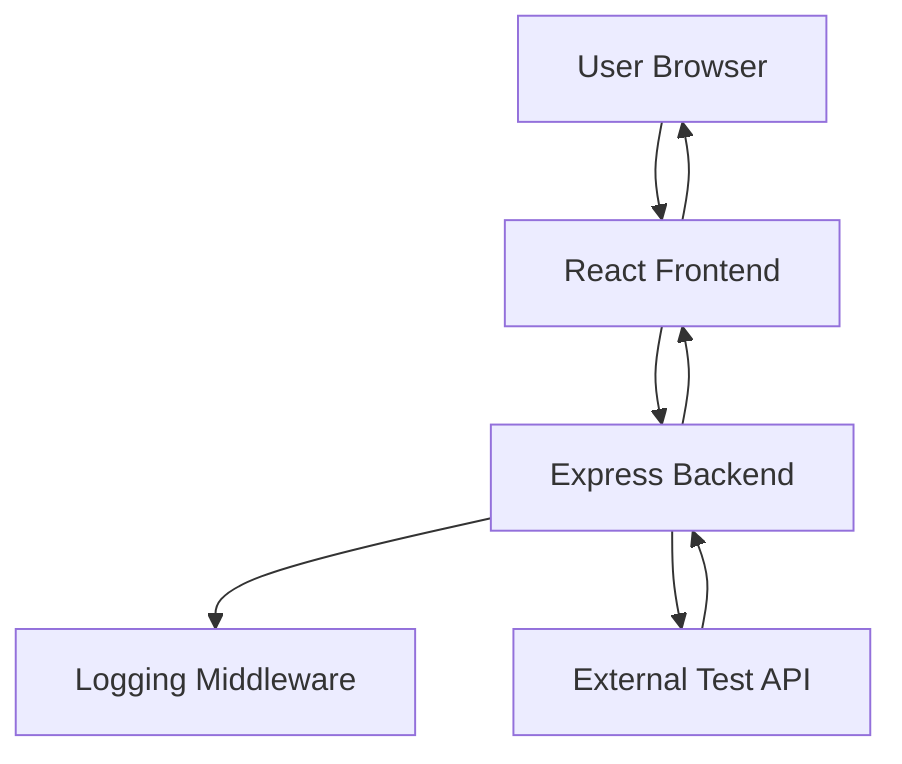

# Proof of Work

## 1. Notifications Page (Filter: Event)

This screenshot demonstrates the Notifications Page displaying only Event-type notifications after applying the filter.



---

## 2. Priority Inbox

This screenshot shows the Priority Inbox where notifications are automatically sorted based on priority levels.



---

## 3. Notification API Verification (Postman)

Verification of the Notifications API endpoint using Postman.



---

## 4. Priority API Verification (Postman)

Verification of the Priority Notifications API endpoint using Postman.



---

## 5. Placement Notification Example

Example of a Placement notification returned by the API and displayed in the UI.



---

## 6. Result Notification Example

Example of a Result notification returned by the API and displayed in the UI.



---

# System Architecture Design



## Architecture Description

### Frontend (React)

- Displays notifications fetched from the backend.
- Supports filtering notifications by category.
- Displays priority notifications separately.
- Provides a responsive user interface.

### Backend (Node.js + Express)

- Exposes REST APIs.
- Fetches notifications from the external test server.
- Processes and filters notification data.
- Determines notification priority.

### Logging Middleware

- Logs incoming API requests.
- Logs outgoing API responses.
- Helps with debugging and monitoring.

### External Test API

- Provides notification data.
- Acts as the source of truth for notifications.
- Accessed securely through backend services.

## Request Flow

1. User opens the React application.
2. React frontend calls backend APIs.
3. Backend logs the request using middleware.
4. Backend fetches data from the external test API.
5. Notifications are processed and prioritized.
6. Response is returned to the frontend.
7. Frontend renders notifications to the user.

## Technology Stack

| Layer | Technology |
|---------|------------|
| Frontend | React.js |
| Backend | Node.js |
| Framework | Express.js |
| HTTP Client | Axios |
| API Testing | Postman |
| Version Control | Git & GitHub |

## Project Structure

```text
2300320130186/
│
├── notification_app_fe/
│
├── notification_app_be/
│
├── screenshots/
│   ├── event_notification.png
│   ├── priority_index.png
│   ├── notification_api_inpostman.png
│   ├── priority_api_inpostman.png
│   ├── placement_notification.png
│   └── result_notification.png
│
├── notification_system_design.md
│
└── README.md
```